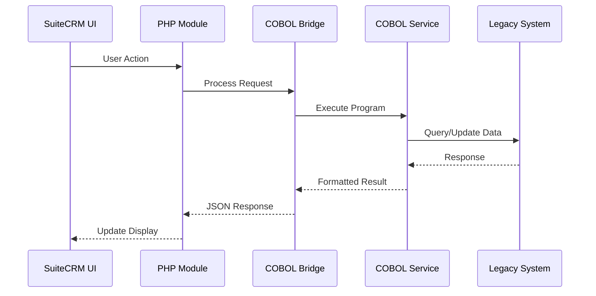

# Enhanced SuiteCRM COBOL Integration Architecture

## Overview
This document outlines the enhanced architecture for deep COBOL integration within SuiteCRM, focusing on real UI elements that provide seamless interaction between PHP frontend and COBOL backend services.

## Target User Segment
**Regional Banks & Credit Unions (6,000+ institutions)**
- Need: Modern CRM interface for legacy COBOL systems
- Pain Points: Manual data reconciliation, lack of real-time integration, decimal precision issues
- Solution: Native COBOL integration with modern UI/UX

## Architecture Components

### 1. Core Integration Layer
```
┌─────────────────────────────────────────────────────────────┐
│                    SuiteCRM PHP Layer                       │
├─────────────────────────────────────────────────────────────┤
│  Custom Modules │ Logic Hooks │ UI Components │ REST API   │
├─────────────────────────────────────────────────────────────┤
│              COBOL Bridge Service Layer                     │
│  ┌─────────┐ ┌──────────┐ ┌──────────┐ ┌──────────────┐  │
│  │ HTTP    │ │ WebSocket│ │ Message  │ │ File         │  │
│  │ Client  │ │ Client   │ │ Queue    │ │ Processing   │  │
│  └─────────┘ └──────────┘ └──────────┘ └──────────────┘  │
├─────────────────────────────────────────────────────────────┤
│                  COBOL Services Layer                       │
│  ┌─────────┐ ┌──────────┐ ┌──────────┐ ┌──────────────┐  │
│  │Financial│ │Validation│ │ Batch    │ │ Legacy Data  │  │
│  │ Calc    │ │ Engine   │ │ Process  │ │ Import/Export│  │
│  └─────────┘ └──────────┘ └──────────┘ └──────────────┘  │
└─────────────────────────────────────────────────────────────┘
```

### 2. Six Enhanced Features Architecture

#### Feature 1: COBOL-Powered Financial Calculations Module
- **Location**: `custom/modules/COBOL_Calculator/`
- **Components**:
  - Advanced loan calculator with amortization
  - Investment return calculator
  - Risk assessment scoring
  - Currency conversion with live rates
- **UI**: Custom SuiteCRM module with jQuery UI components

#### Feature 2: Legacy System Data Import/Export
- **Location**: `custom/modules/Legacy_Bridge/`
- **Components**:
  - EBCDIC to UTF-8 converter
  - Copybook parser
  - Batch file processor
  - Data mapping engine
- **UI**: Wizard-based interface for mapping fields

#### Feature 3: Real-time COBOL Validation
- **Location**: `custom/modules/Business_Rules/`
- **Components**:
  - Account number validation
  - Routing number verification
  - Business rule engine
  - Compliance checker
- **UI**: Inline validation with visual feedback

#### Feature 4: COBOL-Based Reporting Dashboard
- **Location**: `custom/modules/COBOL_Reports/`
- **Components**:
  - Regulatory report generator
  - Financial statement builder
  - Audit trail reporter
  - Performance analytics
- **UI**: Chart.js dashboards with drill-down

#### Feature 5: Automated Batch Processing Workflows
- **Location**: `custom/modules/Batch_Manager/`
- **Components**:
  - Job scheduler
  - Queue manager
  - Status monitor
  - Error recovery
- **UI**: Kanban-style job board

#### Feature 6: API Endpoints for COBOL Services
- **Location**: `custom/api/v1/cobol/`
- **Components**:
  - RESTful endpoints
  - GraphQL interface
  - WebSocket streams
  - API documentation
- **UI**: Swagger UI integration

### 3. Communication Flow



### 4. Data Flow Patterns

#### Synchronous Operations
- Financial calculations
- Validation checks
- Real-time queries

#### Asynchronous Operations
- Batch processing
- Report generation
- Data synchronization

#### Stream Processing
- Transaction monitoring
- Event notifications
- Audit logging

### 5. Security Architecture

- **Authentication**: SSO with mainframe credentials
- **Authorization**: Role-based access control
- **Encryption**: TLS for transit, AES for storage
- **Audit**: Complete transaction logging
- **Compliance**: PCI-DSS, SOX ready

### 6. Performance Optimization

- **Caching**: Redis for frequent calculations
- **Connection Pooling**: Persistent COBOL processes
- **Batch Processing**: Off-peak scheduling
- **Load Balancing**: Multiple COBOL workers

### 7. Deployment Architecture

```yaml
services:
  suitecrm:
    - PHP 7.4 with opcache
    - Apache/Nginx
    - MySQL 5.7+
    
  cobol-bridge:
    - Node.js 16+
    - Express.js
    - Socket.io
    
  cobol-services:
    - GnuCOBOL 3.1
    - Custom runtime
    - Process manager
    
  supporting:
    - Redis (caching)
    - RabbitMQ (queuing)
    - Elasticsearch (search)
```

### 8. Module Integration Points

- **Accounts**: Enhanced with mainframe account data
- **Contacts**: Linked to legacy customer records
- **Opportunities**: COBOL-calculated scoring
- **Quotes**: Precision financial calculations
- **Reports**: COBOL-generated regulatory reports
- **Workflows**: COBOL business rule execution

### 9. Technology Stack

- **Frontend**: SuiteCRM 7.14.6, jQuery, Chart.js, DataTables
- **Backend**: PHP 7.4, Node.js 16, GnuCOBOL 3.1
- **Database**: MySQL 5.7, Redis 6
- **Infrastructure**: Docker, Kubernetes-ready
- **Monitoring**: Prometheus, Grafana

### 10. Development Guidelines

- Follow SuiteCRM module standards
- Use PSR-4 autoloading
- Implement comprehensive error handling
- Write unit tests for all components
- Document all COBOL programs
- Use semantic versioning